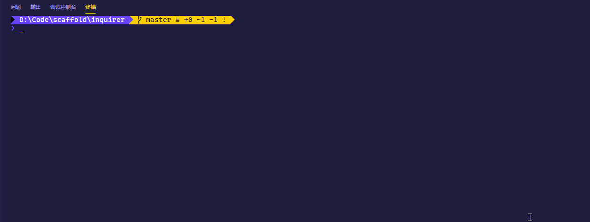

# Inquirer 测试

## questions

### type

- `input`：问题要求输入
- `number`：要求输入数字，非数字得到的答案将会是`null`
- `confirm`：输入确认，`Y/n`
- `list`：选择项，必须同时提供`choices`属性\
- `rawlist`：带有编号的选择项，必须同时提供`choices`属性
- `expand`：也是选项，提供编号以及更复杂的选项内容
- `checkbox`：多选框，一般来说按空格键是选择
- `password`：密码输入，注意一般同时设置`mask: '*'`，否则看不见输入的字符
- `editor`：打开选择的编辑器进行输入

